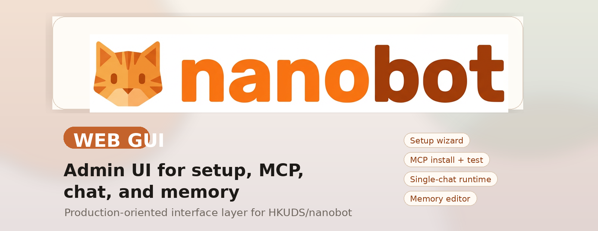

<div align="center">
  
  <h1>nanobot-webgui</h1>
  <p>Production-focused web GUI for <a href="https://github.com/HKUDS/nanobot">HKUDS/nanobot</a>.</p>
  <p>
    <a href="https://github.com/HKUDS/nanobot"></a>
    
    
    
  </p>
</div>

`nanobot-webgui` keeps the official `nanobot` CLI and runtime, then adds a guided browser-based admin experience for setup, MCP lifecycle management, chat, memory editing, logs, and validation.

This repository is intended to be published as a WebGUI-focused fork or distribution layer. The upstream core agent project remains:

- Upstream project: <https://github.com/HKUDS/nanobot>
- This WebGUI fork target: <https://github.com/lucmuss/nanobot-webgui>

## What This Adds
- First-run admin bootstrap and login
- Guided setup wizard for provider, channel, and agent defaults
- Dashboard with readiness, health, setup progress, and next-step guidance
- MCP inspect, install, test, enable/disable, remove, and detail editing
- Single-chat runtime with file upload, prompt templates, usage snapshot, and recent tool activity
- Memory editor with preview, reset-to-template, and document switching
- Runtime logs, validation checks, profile editing, and restart controls
- Safe Mode so beginners see only essential settings first

## Relationship to Upstream
This project is based on the official `nanobot` codebase and should track upstream changes carefully. The goal is not to replace the core agent, but to make it easier to install, operate, and manage for non-technical users.

Use the upstream repository for:
- provider and channel feature coverage
- core agent internals
- release notes and original architecture context

Use this repository for:
- the WebGUI experience
- packaging the GUI into Docker and normal `nanobot` installs
- deployment docs focused on browser-based administration

## Install

### From source
```bash
git clone https://github.com/lucmuss/nanobot-webgui.git
cd nanobot-webgui
pip install -e .
```

### With `uv`
```bash
uv tool install .
```

## Quick Start

### 1. Initialize config and workspace
```bash
nanobot onboard
```

### 2. Start the WebGUI
```bash
nanobot gui --host 0.0.0.0 --port 18791
```

Open:

- Local: <http://127.0.0.1:18791/>

### 3. Complete the browser onboarding
The first launch flow is:

1. Create the one admin account
2. Configure provider credentials
3. Choose an optional channel
4. Configure the default agent runtime
5. Land on the dashboard and continue with MCP installation

## Common CLI Commands

### Start GUI
```bash
nanobot gui --host 0.0.0.0 --port 18791
```

### Start GUI behind HTTPS with secure session cookies
```bash
nanobot gui --host 0.0.0.0 --port 18791 --secure-cookies
```

### Start the headless gateway
```bash
nanobot gateway
```

### Run a direct terminal chat
```bash
nanobot agent -m "Hello!"
```

## Docker

The repository now includes both gateway and GUI services in [`docker-compose.yml`](./docker-compose.yml).

### Start both services
```bash
docker compose up -d --build nanobot-gateway nanobot-gui
```

### Default ports
- `18790`: gateway
- `18791`: WebGUI

### Persistent state
The default compose file mounts:

- `~/.nanobot:/root/.nanobot`

That keeps:
- `config.json`
- sessions and memory
- uploaded avatars
- GUI state and logs
- MCP installs managed by the WebGUI

## Production Notes

For a real deployment:

1. Put the GUI behind HTTPS via reverse proxy.
2. Start the GUI with `--secure-cookies`.
3. Mount a persistent `~/.nanobot` volume.
4. Back up `config.json`, `gui.sqlite3`, and the workspace.
5. Restrict public exposure with network policy, VPN, or auth at the proxy layer.

Detailed deployment guidance is in [WEBGUI.md](./WEBGUI.md).

## MCP Workflow

The intended browser flow is:

1. Paste a GitHub repository URL into `MCP Search`
2. `Inspect Repository`
3. Review detected transport, start command, env vars, and install steps
4. `Install MCP Server`
5. Run `Run MCP Test`
6. Fix missing env values if required
7. `Enable for Chat`

The UI keeps installed MCPs in a registry view, including tool list, status, last test state, and error guidance.

## What the GUI Shows

### Dashboard
- setup progress
- recommended next step
- system health
- recent activity
- last successful chat
- last MCP test

### Chat
- current provider and model
- active MCP servers
- active MCP tools
- recent tool usage
- usage snapshot

### Settings
- runtime toggles and execution settings
- one-click validation
- direct fix actions for failing checks

## Release Checklist
- [x] `nanobot gui` CLI subcommand
- [x] browser onboarding and admin auth
- [x] MCP inspect/install/test/enable/remove
- [x] single-chat runtime
- [x] memory editor and markdown preview
- [x] logs and validation
- [x] static branding banner linked in the GUI
- [x] Docker service for the GUI
- [x] production deployment notes

## Testing

Recommended local checks:

```bash
python3 -m compileall nanobot/gui
pytest tests/test_commands.py tests/test_config_paths.py tests/test_gui_config_service.py
docker compose up -d --build nanobot-gateway nanobot-gui
curl http://127.0.0.1:18791/health
```

## Upstream Credits
This project builds directly on the official `nanobot` work from HKUDS and contributors:

- <https://github.com/HKUDS/nanobot>

If you need deeper provider, channel, or runtime documentation than this WebGUI fork covers, start with the upstream repository.
