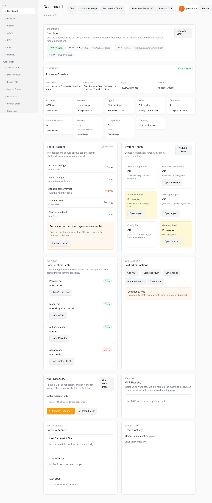
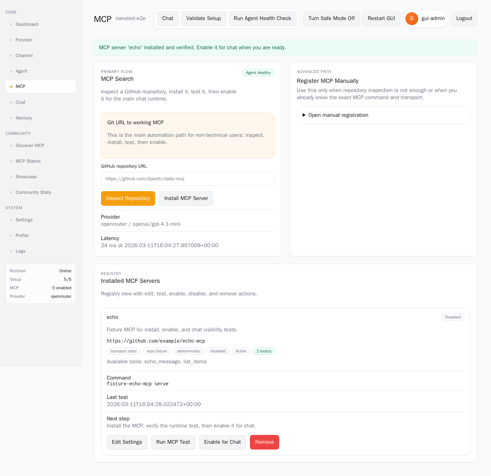
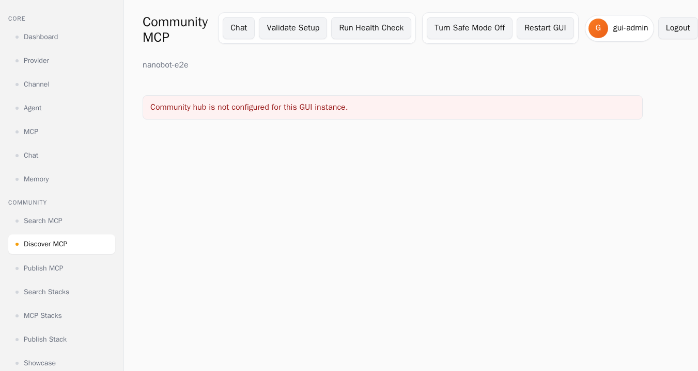

<div align="center">
  <h1>nanobot-webgui</h1>
  <p><strong>Release 0.3.11</strong></p>
  <p>Production-focused browser GUI for <a href="https://github.com/HKUDS/nanobot">HKUDS/nanobot</a>.</p>
  <p>
    
    <a href="https://github.com/HKUDS/nanobot"></a>
    
    
    
  </p>
  <p>
    <a href="https://github.com/HKUDS/nanobot/blob/main/COMMUNICATION.md"></a>
    <a href="https://github.com/HKUDS/nanobot/blob/main/COMMUNICATION.md"></a>
    <a href="https://discord.gg/MnCvHqpUGB"></a>
  </p>
</div>

`nanobot-webgui` installs the official `nanobot` runtime directly from `HKUDS/nanobot@main` and adds a browser-first operations layer for setup, MCP lifecycle management, chat, memory editing, logs, validation, and community-backed discovery.

This repository is for people who want Nanobot to be easier to install, easier to operate, and easier to explain to a new team member.

## What This Project Is

Use `nanobot-webgui` when you want:

- a guided first-run admin setup
- a dashboard that shows what is configured and what is still missing
- MCP inspect, install, test, enable, disable, and registry management
- community discovery for MCP servers, stacks, and showcase templates
- a browser chat with uploads, recent tool activity, and memory editing
- a self-hosted deployment that still uses the upstream Nanobot core

This repository is not a rewrite of Nanobot. It is a distribution layer and operations GUI on top of the upstream agent, with installs always pulling the latest upstream `main` branch.

## Relationship to Upstream

- Upstream Nanobot: <https://github.com/HKUDS/nanobot>
- This WebGUI fork: <https://github.com/lucmuss/nanobot-webgui>

Use the upstream repository for:

- core runtime architecture
- provider and channel internals
- upstream roadmap and base runtime behavior

Use this repository for:

- the WebGUI
- guided installation and onboarding
- MCP registry and browser workflows
- deployment notes for self-hosted GUI operations

## Quick Start

### Fastest path for a new installation

```bash
git clone https://github.com/lucmuss/nanobot-webgui.git
cd nanobot-webgui
pip install -e .[dev]
nanobot onboard
nanobot-webgui gui --host 0.0.0.0 --port 18791
```

`pip install -e .[dev]` installs the current `HKUDS/nanobot@main` runtime plus this GUI overlay.

Open:

- Local: <http://127.0.0.1:18791/>

First-run flow:

1. Create the admin account
2. Configure provider and model
3. Choose a channel or skip it
4. Configure agent defaults
5. Land on the dashboard
6. Install or inspect your first MCP server

### Attach the GUI to an existing Nanobot installation

If you already have a Nanobot workspace and config, point the GUI at those files directly:

```bash
nanobot-webgui gui --config /path/to/config.json --workspace /path/to/workspace
```

The GUI will read and write the selected Nanobot config and create GUI-specific state beside it:

- `gui.sqlite3`
- `gui-state.json`
- `gui-session.secret`
- `media/`
- `logs/`

If this is a live instance, make a backup first.

## Install Options

### From source

```bash
git clone https://github.com/lucmuss/nanobot-webgui.git
cd nanobot-webgui
pip install -e .
```

This install path also pulls the latest upstream `nanobot` `main` branch.

### With `uv`

```bash
uv tool install .
```

### Development install

```bash
pip install -e .[dev]
npm ci
npm run test:e2e:install
```

## Main Browser Areas

### Dashboard

- setup progress
- health validation
- MCP registry snapshot
- recent activity
- community recommendations

### MCP

- inspect a repository
- install from a detected plan
- run MCP tests
- enable or disable for chat
- copy command or endpoint safely

### Community

- `Discover MCP`
- `Search MCP`
- `Publish MCP`
- `MCP Stacks`
- `Search Stacks`
- `Publish Stack`
- `Showcase`
- `Community Stats`

### Chat and Memory

- direct chat with the configured runtime
- upload files into the session
- inspect recent tool activity
- edit `SOUL.md`, `USER.md`, `AGENTS.md`, `TOOLS.md`, and memory docs in the browser

## Docker

The repository includes a compose setup that supports gateway and GUI services together.

### Start the GUI stack

```bash
docker compose up -d --build nanobot-gateway nanobot-gui
```

### Default ports

- `18790`: gateway
- `18791`: WebGUI
- `18811`: Community Hub

### Persistent state

The default compose setup mounts:

- `~/.nanobot:/root/.nanobot`

That keeps:

- `config.json`
- sessions and memory
- uploaded avatars
- GUI state and logs
- MCP installs managed by the GUI

## Community Hub Integration

The WebGUI can consume live marketplace data from `nanobot-community-hub`.

That gives you:

- MCP discovery and MCP detail pages
- stack import flows
- showcase import flows
- recommended config hints
- optional anonymous MCP runtime telemetry

Recommended split in this environment:

- WebGUI repo: `/srv/projects/agents/nanobot-dev-src`
- Community Hub repo: `/srv/projects/services/nanobot-hub`
- stack runtime: `/srv/docker/ai-stack`

Typical wiring:

- internal community API: `http://nanobot-community-hub:18811/api/v1`
- public hub URL: `https://nanobot-hub.eu`
- public GUI URL: `https://your-nanobot-gui.example.com`

Cloudflare tunnel example:

- `your-nanobot-gui.example.com` -> `http://host.docker.internal:18791`
- `nanobot-hub.eu` -> `http://host.docker.internal:18811`

## Common Commands

### Start GUI

```bash
nanobot-webgui gui --host 0.0.0.0 --port 18791
```

### Start GUI with secure cookies

```bash
nanobot-webgui gui --host 0.0.0.0 --port 18791 --secure-cookies
```

### Start GUI with release checks

```bash
nanobot-webgui gui \
  --host 0.0.0.0 \
  --port 18791 \
  --update-check \
  --update-repo lucmuss/nanobot-webgui \
  --update-mode command \
  --update-command "/usr/local/bin/nanobot-webgui-update.sh"
```

### Start the headless runtime

```bash
nanobot gateway
```

### Run a direct terminal message

```bash
nanobot agent -m "Hello!"
```

## Recommended Testing Commands

Quick local checks:

```bash
python3 -m compileall nanobot_webgui
python3 -m pytest tests -q
python3 -m build
```

Browser coverage:

```bash
npm run test:e2e:critical
npm run test:e2e:full
npm run test:e2e:a11y
```

If your host does not have the full Playwright toolchain:

```bash
./scripts/e2e/run_playwright_in_docker.sh
```

Detailed testing notes are in [GUI_TESTING.md](./GUI_TESTING.md).

## New User Notes

If someone asks:

- "Can I use this without a previous Nanobot install?"
- "Can I connect this to an existing workspace?"

The answer is yes to both.

What the GUI does not do is magically discover an arbitrary running Nanobot instance. You still point it at the config and workspace you want it to manage.

## Production Notes

For a real deployment:

1. Put the GUI behind HTTPS
2. Run with `--secure-cookies`
3. Mount a persistent `~/.nanobot` directory
4. Back up `config.json`, `gui.sqlite3`, and the workspace
5. Restrict public exposure with proxy auth, VPN, or network policy
6. Use an explicit update command instead of in-container self-mutation

Detailed deployment guidance is in [WEBGUI.md](./WEBGUI.md).

## Security

Read [SECURITY.md](./SECURITY.md) before exposing the GUI publicly.

The most important rules are:

- never commit API keys
- keep `~/.nanobot` private and backed up
- do not run broad unrestricted shell access unless you intentionally accept that risk
- use allowlists for public channels

## Star History

[](https://www.star-history.com/#lucmuss/nanobot-webgui&Date)

## Upstream Credits

This project builds directly on the official `nanobot` work from HKUDS and contributors:

- <https://github.com/HKUDS/nanobot>

If you need deeper provider, channel, or runtime documentation than this WebGUI fork covers, start with the upstream repository.

## Screenshot Gallery

<p align="center">
  
  
  
</p>
